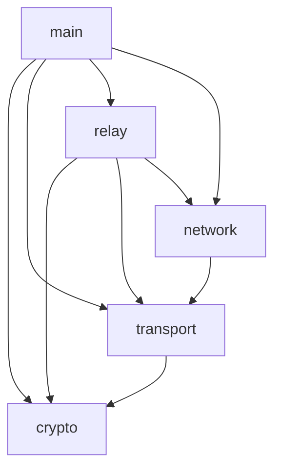

# Code Structure

## Project Layout

```
src/
├── crypto/
│   ├── mod.rs               # Crypto module entry point
│   ├── keys.rs              # Key management
│   ├── encryption.rs        # Encryption operations
│   └── signatures.rs        # Digital signatures
│
├── transport/
│   ├── mod.rs               # Transport module entry point
│   ├── tcp.rs               # TCP implementation
│   ├── quic.rs              # QUIC implementation
│   └── traits.rs            # Transport traits
│
├── relay/
│   ├── mod.rs               # Relay module entry point
│   ├── node.rs              # Relay node implementation
│   ├── circuit.rs           # Circuit management
│   └── routing.rs           # Routing logic
│
├── network/
│   ├── mod.rs               # Network module entry point
│   ├── discovery.rs         # Node discovery
│   ├── health.rs            # Health monitoring
│   └── metrics.rs           # Network metrics
│
├── protocol/
│   ├── mod.rs               # Protocol module entry point
│   ├── messages.rs          # Protocol messages
│   ├── handshake.rs         # Protocol handshake
│   └── errors.rs            # Protocol errors
│
├── utils/
│   ├── mod.rs               # Utilities module entry point 
│   ├── error.rs             # Error types and handling
│   ├── config.rs            # Configuration management
│   └── testing.rs           # Test utilities
│
└── main.rs                  # Application entry point
```

## Module Dependencies



## Key Components

### 1. Crypto Module
- Key management
- Encryption/decryption
- Digital signatures
- Random number generation

### 2. Transport Module
- Abstract transport interface
- TCP implementation
- QUIC implementation
- Connection management

### 3. Relay Module
- Circuit creation
- Message routing
- Node management
- State tracking

### 4. Network Module
- Node discovery
- Health monitoring
- Metrics collection
- Network topology

### 5. Protocol Module
- Message definitions
- Handshake protocol
- Error handling
- Protocol versioning

### 6. Utils Module
- Common utilities
- Error types
- Configuration
- Testing helpers

## Testing Structure

```
tests/
├── unit/
│   ├── crypto_tests.rs
│   ├── transport_tests.rs
│   ├── relay_tests.rs
│   └── network_tests.rs
│
├── integration/
│   ├── circuit_tests.rs
│   ├── protocol_tests.rs
│   └── end_to_end_tests.rs
│
└── common/
    ├── mod.rs
    └── helpers.rs
```

## Configuration Files

```
config/
├── default.toml          # Default configuration
├── development.toml      # Development settings
├── testing.toml         # Test configuration
└── production.toml      # Production settings
```

## Build and Development Tools

```
tools/
├── build.rs             # Custom build script
├── lint.sh             # Linting script
├── test.sh            # Test runner
└── benchmark.sh       # Benchmark runner
```

## Documentation Structure

```
docs/
├── architecture/
│   ├── overview.md
│   ├── crypto.md
│   └── protocol.md
│
├── api/
│   ├── transport.md
│   ├── relay.md
│   └── network.md
│
└── deployment/
    ├── setup.md
    └── monitoring.md
```

## Coding Guidelines

1. Module Organization
   - One module per file
   - Clear module boundaries
   - Minimal dependencies
   - Public interface documentation

2. Error Handling
   - Custom error types per module
   - Error propagation chains
   - Recovery strategies
   - Logging points

3. Testing Strategy
   - Unit tests alongside code
   - Integration tests in tests/
   - Property-based testing
   - Continuous benchmarking

4. Documentation
   - Module-level documentation
   - Function documentation
   - Example code
   - Error documentation

5. Performance Considerations
   - Async/await usage
   - Resource management
   - Memory optimization
   - Profile-guided optimization